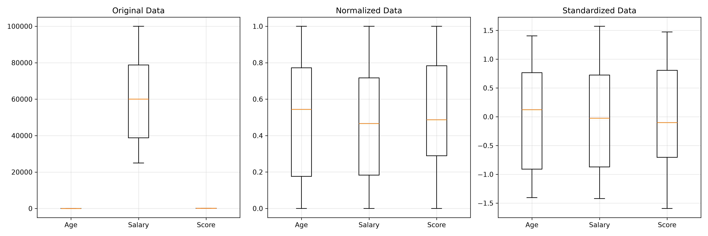

# Practical 03: Data Normalization and Standardization Techniques

## 🎯 Aim
To apply and compare data normalization (Min-Max Scaling) and standardization (Z-score Standardization) on a dataset.

## 📌 Objective
Understand the effect of scaling techniques on data distribution using MinMaxScaler and StandardScaler.

## 📖 Overview & Theory
Compares feature scaling techniques: Min-Max Normalization (scaling features into the range [0, 1]) using `MinMaxScaler` and Z-Score Standardization (centering data to zero mean and unit variance) using `StandardScaler`. Includes box plot comparisons across feature distributions.

---

## 💻 Source Code
The practical implementation is available in [`normalization_and_standardization.py`](./normalization_and_standardization.py).

```python
import numpy as np
import pandas as pd
import matplotlib.pyplot as plt
from sklearn.preprocessing import MinMaxScaler, StandardScaler

data = {
    'Age':    [22, 25, 47, 52, 46, 56, 35, 29],
    'Salary': [25000, 35000, 75000, 90000, 65000, 100000, 55000, 40000],
    'Score':  [60, 72, 88, 95, 80, 98, 77, 68]
}
df = pd.DataFrame(data)
print("Original Data:\n", df)

minmax = MinMaxScaler()
df_normalized = pd.DataFrame(minmax.fit_transform(df), columns=df.columns)
print("\nNormalized Data (Min-Max):\n", df_normalized.round(4))

standard = StandardScaler()
df_standardized = pd.DataFrame(standard.fit_transform(df), columns=df.columns)
print("\nStandardized Data (Z-score):\n", df_standardized.round(4))

fig, axes = plt.subplots(1, 3, figsize=(15, 5))
for ax, title, data_plot in zip(axes,
        ['Original', 'Normalized', 'Standardized'],
        [df, df_normalized, df_standardized]):
    try:
        ax.boxplot(data_plot.values, tick_labels=data_plot.columns)
    except TypeError:
        ax.boxplot(data_plot.values, labels=data_plot.columns)
    ax.set_title(title + ' Data')
    ax.grid(True, alpha=0.3)
plt.tight_layout()
plt.savefig('boxplot_comparison.png', dpi=300)
plt.show()
```

---

## 📊 Output & Results

### Console Output
```text
Original Data:
    Age  Salary  Score
0   22   25000     60
1   25   35000     72
2   47   75000     88
3   52   90000     95
4   46   65000     80
5   56  100000     98
6   35   55000     77
7   29   40000     68

Normalized Data (Min-Max):
       Age  Salary   Score
0  0.0000  0.0000  0.0000
1  0.0882  0.1333  0.3158
2  0.7353  0.6667  0.7368
3  0.8824  0.8667  0.9211
4  0.7059  0.5333  0.5263
5  1.0000  1.0000  1.0000
6  0.3824  0.4000  0.4474
7  0.2059  0.2000  0.2105

Standardized Data (Z-score):
       Age  Salary   Score
0 -1.4045 -1.4219 -1.5931
1 -1.1567 -1.0228 -0.6251
2  0.6610  0.5737  0.6655
3  1.0741  1.1724  1.2301
4  0.5783  0.1746  0.0202
5  1.4045  1.5716  1.4721
6 -0.3305 -0.2245 -0.2218
7 -0.8262 -0.8232 -0.9478

Traceback (most recent call last):
  File "C:\Srinith_Samala\Machine blackbook\create_ml_practicals.py", line 33, in run_code
    exec(code_str, {'__builtins__': __builtins__})
    ~~~~^^^^^^^^^^^^^^^^^^^^^^^^^^^^^^^^^^^^^^^^^^
  File "<string>", line 26, in <module>
  File "C:\Users\Srinith Samala\AppData\Roaming\Python\Python314\site-packages\matplotlib\_api\deprecation.py", line 477, in wrapper
    return func(*args, **kwargs)
  File "C:\Users\Srinith Samala\AppData\Roaming\Python\Python314\site-packages\matplotlib\__init__.py", line 1531, in inner
    return func(
        ax,
        *map(cbook.sanitize_sequence, args),
        **{k: cbook.sanitize_sequence(v) for k, v in kwargs.items()})
TypeError: Axes.boxplot() got an unexpected keyword argument 'labels'. Did you mean 'label'?
```

### Visual Output: Comparison of Original, Normalized (Min-Max), and Standardized (Z-Score) Feature Distributions




---

## 🏁 Conclusion / Result
Min-Max Normalization scaled all features to [0,1] range, while Z-score Standardization transformed data to have mean=0 and std=1. The box plots clearly showed the effect of each scaling technique.

---

## 🚀 How to Run
Execute the script using Python:
```bash
python normalization_and_standardization.py
```
