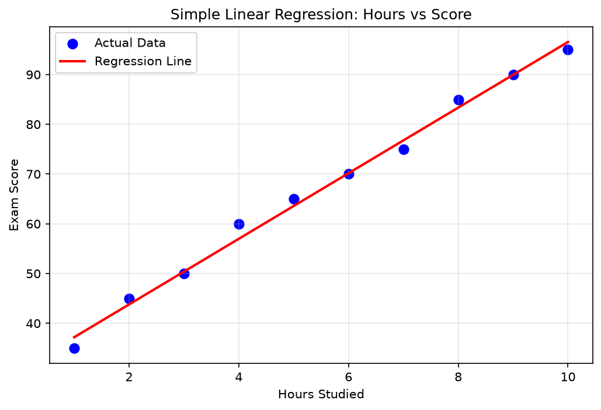

# Practical 04: Implementation of Simple Linear Regression

## 🎯 Aim
To implement Simple Linear Regression to predict a continuous output variable based on a single input feature.

## 📌 Objective
Build a linear regression model using Scikit-learn, evaluate using R² score and MSE, and visualize the regression line.

## 📖 Overview & Theory
Implements Simple Linear Regression using Scikit-Learn to model the relationship between a single independent variable (Hours Studied) and a continuous dependent variable (Exam Score). Evaluates model performance using Mean Squared Error (MSE) and R-squared (R²) metrics, accompanied by regression line visualization.

---

## 💻 Source Code
The practical implementation is available in [`simple_linear_regression.py`](./simple_linear_regression.py).

```python
import numpy as np
import pandas as pd
import matplotlib.pyplot as plt
from sklearn.linear_model import LinearRegression
from sklearn.model_selection import train_test_split
from sklearn.metrics import mean_squared_error, r2_score

data = {
    'Hours_Studied': [1, 2, 3, 4, 5, 6, 7, 8, 9, 10],
    'Exam_Score':    [35, 45, 50, 60, 65, 70, 75, 85, 90, 95]
}
df = pd.DataFrame(data)
print("Dataset:\n", df)

X = df[['Hours_Studied']]
y = df['Exam_Score']

X_train, X_test, y_train, y_test = train_test_split(X, y, test_size=0.2, random_state=42)

model = LinearRegression()
model.fit(X_train, y_train)

print(f"\nIntercept: {model.intercept_:.4f}")
print(f"Slope:     {model.coef_[0]:.4f}")

y_pred = model.predict(X_test)
print("\nPredictions vs Actual:")
for pred, actual in zip(y_pred, y_test):
    print(f"  Predicted: {pred:.2f}  |  Actual: {actual}")

mse = mean_squared_error(y_test, y_pred)
r2  = r2_score(y_test, y_pred)
print(f"\nMSE: {mse:.4f}")
print(f"R2:  {r2:.4f}")

plt.figure(figsize=(8, 5))
plt.scatter(X, y, color='blue', label='Actual Data', s=60)
plt.plot(X, model.predict(X), color='red', linewidth=2, label='Regression Line')
plt.title('Simple Linear Regression: Hours vs Score')
plt.xlabel('Hours Studied')
plt.ylabel('Exam Score')
plt.legend()
plt.grid(True, alpha=0.3)
plt.savefig('regression_line.png', dpi=300)
plt.show()
```

---

## 📊 Output & Results

### Console Output
```text
Dataset:
    Hours_Studied  Exam_Score
0              1          35
1              2          45
2              3          50
3              4          60
4              5          65
5              6          70
6              7          75
7              8          85
8              9          90
9             10          95

Intercept: 30.6034
Slope:     6.5948

Predictions vs Actual:
  Predicted: 89.96  |  Actual: 90
  Predicted: 43.79  |  Actual: 45

MSE: 0.7292
R2:  0.9986
```

### Visual Output: Simple Linear Regression: Hours Studied vs Exam Score with Best-Fit Line




---

## 🏁 Conclusion / Result
Simple Linear Regression model was trained successfully. The regression line fits the data well. MSE and R2 score indicate good model performance.

---

## 🚀 How to Run
Execute the script using Python:
```bash
python simple_linear_regression.py
```
