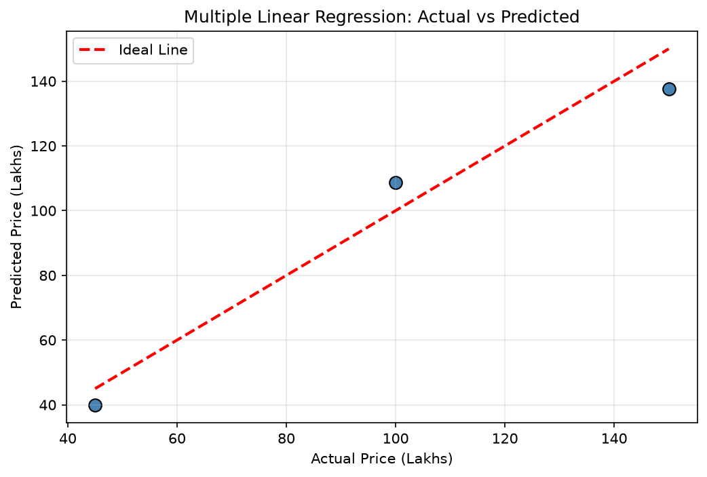

# Practical 05: Implementation of Multiple Linear Regression

## 🎯 Aim
To implement Multiple Linear Regression to predict a continuous output variable using more than one input feature.

## 📌 Objective
Build a multiple linear regression model using Scikit-learn on a house price dataset, evaluate it using R2, MSE, and RMSE.

## 📖 Overview & Theory
Builds a Multiple Linear Regression model using multiple independent predictor variables (Area in sqft, Number of Bedrooms, and Age of House in years) to predict House Prices in Lakhs. Calculates model intercept, feature coefficients, MSE, RMSE, and R² score, and visualizes actual versus predicted values against a perfect-fit line.

---

## 💻 Source Code
The practical implementation is available in [`multiple_linear_regression.py`](./multiple_linear_regression.py).

```python
import numpy as np
import pandas as pd
import matplotlib.pyplot as plt
from sklearn.linear_model import LinearRegression
from sklearn.model_selection import train_test_split
from sklearn.metrics import mean_squared_error, r2_score

data = {
    'Area_sqft':   [1000, 1500, 2000, 2500, 3000, 3500, 4000, 4500, 5000, 5500],
    'Bedrooms':    [2, 3, 3, 4, 4, 5, 5, 6, 6, 7],
    'Age_years':   [10, 8, 15, 5, 12, 3, 7, 2, 20, 1],
    'Price_lakhs': [30, 45, 55, 70, 80, 100, 120, 140, 150, 180]
}
df = pd.DataFrame(data)
print("Dataset:\n", df)

X = df[['Area_sqft', 'Bedrooms', 'Age_years']]
y = df['Price_lakhs']

X_train, X_test, y_train, y_test = train_test_split(X, y, test_size=0.3, random_state=42)

model = LinearRegression()
model.fit(X_train, y_train)

print(f"\nIntercept: {model.intercept_:.4f}")
for feat, coef in zip(X.columns, model.coef_):
    print(f"  {feat}: {coef:.4f}")

y_pred = model.predict(X_test)
mse  = mean_squared_error(y_test, y_pred)
rmse = np.sqrt(mse)
r2   = r2_score(y_test, y_pred)

print(f"\nMSE:  {mse:.4f}")
print(f"RMSE: {rmse:.4f}")
print(f"R2:   {r2:.4f}")

plt.figure(figsize=(8, 5))
plt.scatter(y_test, y_pred, color='steelblue', edgecolors='black', s=80)
plt.plot([y_test.min(), y_test.max()], [y_test.min(), y_test.max()], 'r--', linewidth=2, label='Ideal Line')
plt.xlabel('Actual Price (Lakhs)')
plt.ylabel('Predicted Price (Lakhs)')
plt.title('Multiple Linear Regression: Actual vs Predicted')
plt.legend()
plt.grid(True, alpha=0.3)
plt.savefig('actual_vs_predicted.png', dpi=300)
plt.show()
```

---

## 📊 Output & Results

### Console Output
```text
Dataset:
    Area_sqft  Bedrooms  Age_years  Price_lakhs
0       1000         2         10           30
1       1500         3          8           45
2       2000         3         15           55
3       2500         4          5           70
4       3000         4         12           80
5       3500         5          3          100
6       4000         5          7          120
7       4500         6          2          140
8       5000         6         20          150
9       5500         7          1          180

Intercept: 15.6098
  Area_sqft: 0.0393
  Bedrooms: -8.0762
  Age_years: -1.2964

MSE:  85.8869
RMSE: 9.2675
R2:   0.9533
```

### Visual Output: Multiple Linear Regression: Actual vs. Predicted House Prices Scatter Plot




---

## 🏁 Conclusion / Result
Multiple Linear Regression was implemented using Area, Bedrooms, and Age as features. R2, MSE, and RMSE were computed. The scatter plot showed the model prediction accuracy.

---

## 🚀 How to Run
Execute the script using Python:
```bash
python multiple_linear_regression.py
```
