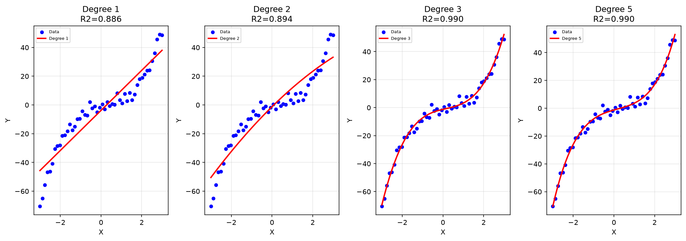

# Practical 06: Polynomial Regression on a Sample Dataset

## 🎯 Aim
To implement Polynomial Regression to model non-linear relationships between variables.

## 📌 Objective
Transform features using PolynomialFeatures and fit polynomial curves; compare multiple degrees.

## 📖 Overview & Theory
Explores non-linear modeling using Polynomial Regression with Scikit-Learn `Pipeline` and `PolynomialFeatures`. Compares polynomial models of degrees 1, 2, 3, and 5 on synthetic non-linear data to demonstrate underfitting, optimal fit (degree 3), and potential overfitting.

---

## 💻 Source Code
The practical implementation is available in [`polynomial_regression.py`](./polynomial_regression.py).

```python
import numpy as np
import matplotlib.pyplot as plt
from sklearn.linear_model import LinearRegression
from sklearn.preprocessing import PolynomialFeatures
from sklearn.pipeline import Pipeline
from sklearn.metrics import r2_score, mean_squared_error

np.random.seed(42)
X = np.linspace(-3, 3, 50).reshape(-1, 1)
y = 2*X**3 - X**2 + 3*X + np.random.normal(0, 3, X.shape)

degrees = [1, 2, 3, 5]
plt.figure(figsize=(14, 5))

for i, degree in enumerate(degrees, 1):
    model = Pipeline([
        ('poly', PolynomialFeatures(degree=degree)),
        ('linear', LinearRegression())
    ])
    model.fit(X, y)
    y_pred = model.predict(X)
    r2 = r2_score(y, y_pred)

    plt.subplot(1, 4, i)
    plt.scatter(X, y, color='blue', s=20, label='Data')
    plt.plot(X, y_pred, color='red', linewidth=2, label=f'Degree {degree}')
    plt.title(f'Degree {degree}\nR2={r2:.3f}')
    plt.xlabel('X')
    plt.ylabel('Y')
    plt.legend(fontsize=6)
    plt.grid(True, alpha=0.3)

plt.tight_layout()
plt.savefig('polynomial_curves.png', dpi=300)
plt.show()

best_model = Pipeline([('poly', PolynomialFeatures(degree=3)), ('linear', LinearRegression())])
best_model.fit(X, y)
y_best = best_model.predict(X)
print(f"Best Model (Degree 3) -- R2: {r2_score(y, y_best):.4f} | MSE: {mean_squared_error(y, y_best):.4f}")
```

---

## 📊 Output & Results

### Console Output
```text
Best Model (Degree 3) -- R2: 0.9899 | MSE: 6.8876
```

### Visual Output: Comparison of Polynomial Regression Curves for Degrees 1, 2, 3, and 5




---

## 🏁 Conclusion / Result
Polynomial Regression curves of degrees 1, 2, 3, and 5 were fitted. Degree 3 gave the best R2 without overfitting.

---

## 🚀 How to Run
Execute the script using Python:
```bash
python polynomial_regression.py
```
