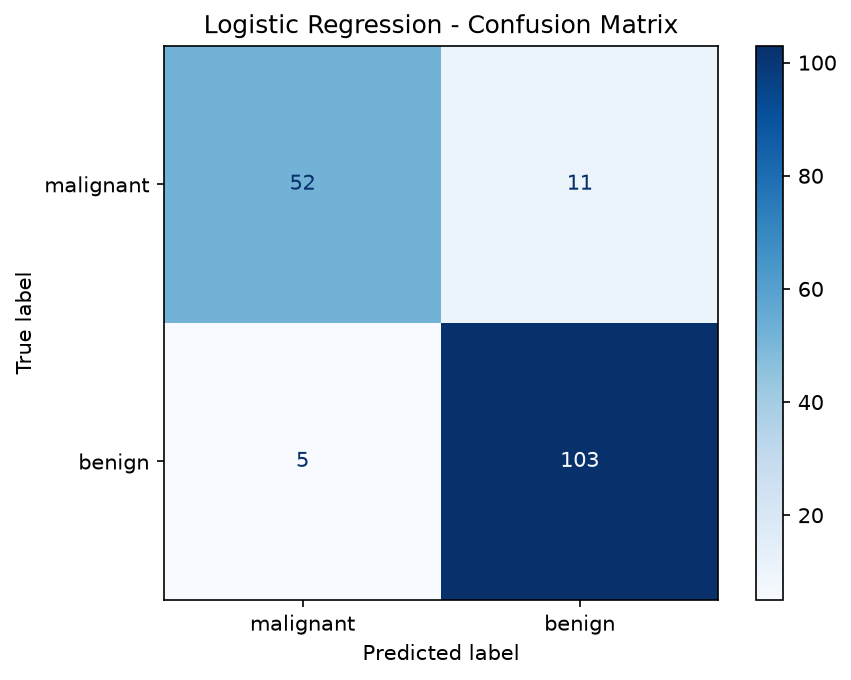

# Practical 07: Logistic Regression for Binary Classification

## 🎯 Aim
To implement Logistic Regression for binary classification and evaluate using accuracy, confusion matrix, precision, recall, and F1-score.

## 📌 Objective
Apply logistic regression on the Breast Cancer dataset, visualize the confusion matrix.

## 📖 Overview & Theory
Implements Logistic Regression for binary medical classification on the Breast Cancer Wisconsin dataset. Evaluates classification performance through accuracy, precision, recall, F1-score, and a confusion matrix heatmap displayed using `ConfusionMatrixDisplay`.

---

## 💻 Source Code
The practical implementation is available in [`logistic_regression.py`](./logistic_regression.py).

```python
import numpy as np
import pandas as pd
import matplotlib.pyplot as plt
from sklearn.linear_model import LogisticRegression
from sklearn.model_selection import train_test_split
from sklearn.metrics import accuracy_score, confusion_matrix, classification_report, ConfusionMatrixDisplay
from sklearn.datasets import load_breast_cancer

cancer = load_breast_cancer()
X = pd.DataFrame(cancer.data[:, :2], columns=cancer.feature_names[:2])
y = cancer.target

print("Dataset shape:", X.shape)
print("Class distribution:", np.bincount(y))

X_train, X_test, y_train, y_test = train_test_split(X, y, test_size=0.3, random_state=42)

model = LogisticRegression(max_iter=10000)
model.fit(X_train, y_train)
y_pred = model.predict(X_test)

print("\nAccuracy:", accuracy_score(y_test, y_pred))
print("\nClassification Report:\n", classification_report(y_test, y_pred, target_names=cancer.target_names))

cm = confusion_matrix(y_test, y_pred)
disp = ConfusionMatrixDisplay(cm, display_labels=cancer.target_names)
disp.plot(cmap='Blues')
plt.title('Logistic Regression - Confusion Matrix')
plt.savefig('confusion_matrix.png', dpi=300)
plt.show()
```

---

## 📊 Output & Results

### Console Output
```text
Dataset shape: (569, 2)
Class distribution: [212 357]

Accuracy: 0.9064327485380117

Classification Report:
               precision    recall  f1-score   support

   malignant       0.91      0.83      0.87        63
      benign       0.90      0.95      0.93       108

    accuracy                           0.91       171
   macro avg       0.91      0.89      0.90       171
weighted avg       0.91      0.91      0.91       171
```

### Visual Output: Logistic Regression Confusion Matrix on Breast Cancer Test Dataset




---

## 🏁 Conclusion / Result
Logistic Regression was applied for binary classification on the Breast Cancer dataset. The confusion matrix and classification report showed good precision, recall, and F1-scores.

---

## 🚀 How to Run
Execute the script using Python:
```bash
python logistic_regression.py
```
