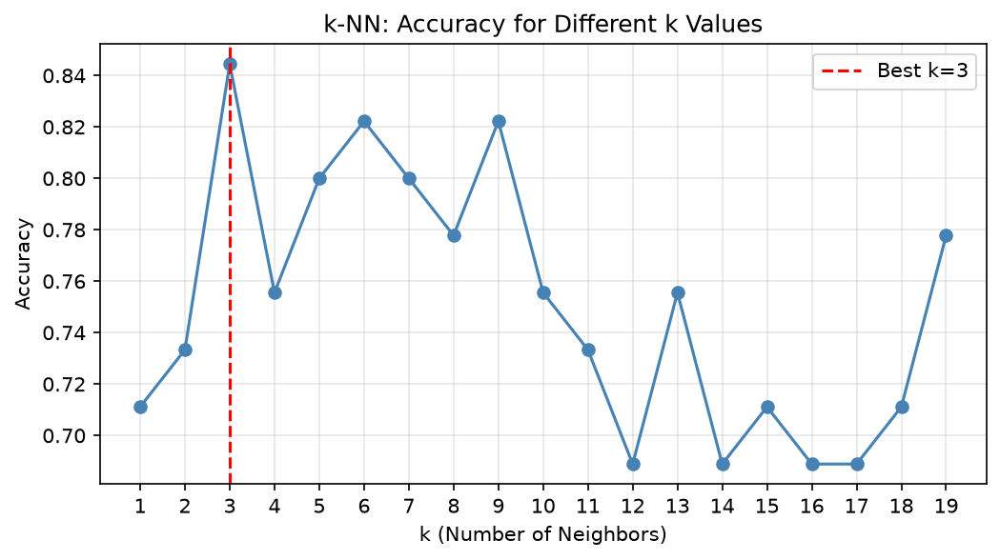

# Practical 08: k-Nearest Neighbors (k-NN) Classifier Implementation

## 🎯 Aim
To implement k-NN algorithm for classification and find the optimal value of k.

## 📌 Objective
Apply k-NN on the Iris dataset, plot accuracy for different k values, and generate the classification report.

## 📖 Overview & Theory
Implements the k-Nearest Neighbors (k-NN) instance-based classification algorithm on the Iris dataset. Features are scaled using `StandardScaler`, and hyperparameter tuning is conducted across k = 1 to 19 to discover the optimal value of k with highest testing accuracy.

---

## 💻 Source Code
The practical implementation is available in [`knn_classifier.py`](./knn_classifier.py).

```python
import numpy as np
import matplotlib.pyplot as plt
from sklearn.neighbors import KNeighborsClassifier
from sklearn.model_selection import train_test_split
from sklearn.preprocessing import StandardScaler
from sklearn.metrics import accuracy_score, classification_report
from sklearn.datasets import load_iris

iris = load_iris()
X = iris.data[:, :2]
y = iris.target
print("Iris Dataset - Classes:", iris.target_names)

scaler = StandardScaler()
X_scaled = scaler.fit_transform(X)
X_train, X_test, y_train, y_test = train_test_split(X_scaled, y, test_size=0.3, random_state=42)

k_values = range(1, 20)
accuracies = []
for k in k_values:
    knn = KNeighborsClassifier(n_neighbors=k)
    knn.fit(X_train, y_train)
    accuracies.append(accuracy_score(y_test, knn.predict(X_test)))

best_k = list(k_values)[np.argmax(accuracies)]
print(f"Best k: {best_k} with Accuracy: {max(accuracies):.4f}")

knn_best = KNeighborsClassifier(n_neighbors=best_k)
knn_best.fit(X_train, y_train)
y_pred = knn_best.predict(X_test)
print("\nClassification Report:\n", classification_report(y_test, y_pred, target_names=iris.target_names))

plt.figure(figsize=(8, 4))
plt.plot(list(k_values), accuracies, marker='o', color='steelblue')
plt.xlabel('k (Number of Neighbors)')
plt.ylabel('Accuracy')
plt.title('k-NN: Accuracy for Different k Values')
plt.xticks(list(k_values))
plt.grid(True, alpha=0.3)
plt.axvline(x=best_k, color='red', linestyle='--', label=f'Best k={best_k}')
plt.legend()
plt.savefig('knn_accuracy_vs_k.png', dpi=300)
plt.show()
```

---

## 📊 Output & Results

### Console Output
```text
Iris Dataset - Classes: ['setosa' 'versicolor' 'virginica']
Best k: 3 with Accuracy: 0.8444

Classification Report:
               precision    recall  f1-score   support

      setosa       1.00      1.00      1.00        19
  versicolor       0.80      0.62      0.70        13
   virginica       0.69      0.85      0.76        13

    accuracy                           0.84        45
   macro avg       0.83      0.82      0.82        45
weighted avg       0.85      0.84      0.84        45
```

### Visual Output: k-NN Classification Accuracy vs. Value of k (Hyperparameter Tuning)




---

## 🏁 Conclusion / Result
k-NN classifier was implemented on the Iris dataset. The optimal k was found by plotting accuracy for k=1 to 19. Feature scaling improved performance.

---

## 🚀 How to Run
Execute the script using Python:
```bash
python knn_classifier.py
```
