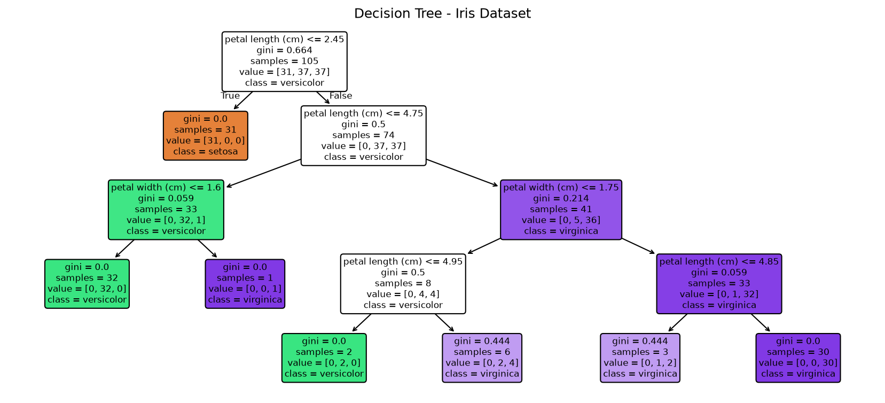
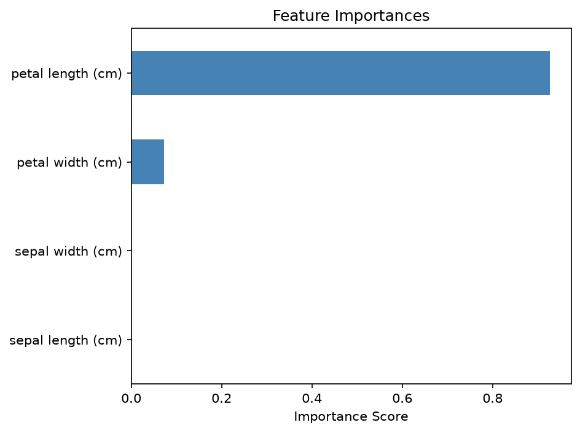

# Practical 09: Decision Tree Classifier Implementation

## 🎯 Aim
To implement a Decision Tree classifier and visualize the tree structure and feature importances.

## 📌 Objective
Train a Decision Tree on the Iris dataset, tune max_depth, and analyze feature importances.

## 📖 Overview & Theory
Builds and visualizes a Decision Tree Classifier (`DecisionTreeClassifier` with `max_depth=4`) on the Iris dataset. Exports the hierarchical tree structure as text and graphical diagram using `plot_tree`, and computes Gini-based feature importances.

---

## 💻 Source Code
The practical implementation is available in [`decision_tree_classifier.py`](./decision_tree_classifier.py).

```python
import numpy as np
import pandas as pd
import matplotlib.pyplot as plt
from sklearn.tree import DecisionTreeClassifier, plot_tree, export_text
from sklearn.model_selection import train_test_split
from sklearn.metrics import accuracy_score, classification_report
from sklearn.datasets import load_iris

iris = load_iris()
X, y = iris.data, iris.target
feature_names = iris.feature_names
class_names   = iris.target_names.tolist()

X_train, X_test, y_train, y_test = train_test_split(X, y, test_size=0.3, random_state=42)

dt = DecisionTreeClassifier(criterion='gini', max_depth=4, random_state=42)
dt.fit(X_train, y_train)
y_pred = dt.predict(X_test)

print("Accuracy:", accuracy_score(y_test, y_pred))
print("\nClassification Report:\n", classification_report(y_test, y_pred, target_names=class_names))
print("\nTree Structure:\n", export_text(dt, feature_names=list(feature_names)))

plt.figure(figsize=(14, 6))
plot_tree(dt, feature_names=feature_names, class_names=class_names, filled=True, rounded=True, fontsize=8)
plt.title('Decision Tree - Iris Dataset')
plt.savefig('decision_tree_structure.png', dpi=300)
plt.savefig('feature_importances.png', dpi=300)
plt.show()

importances = pd.Series(dt.feature_importances_, index=feature_names)
importances.sort_values().plot(kind='barh', color='steelblue')
plt.title('Feature Importances')
plt.xlabel('Importance Score')
plt.tight_layout()
plt.savefig('decision_tree_structure.png', dpi=300)
plt.savefig('feature_importances.png', dpi=300)
plt.show()
```

---

## 📊 Output & Results

### Console Output
```text
Accuracy: 1.0

Classification Report:
               precision    recall  f1-score   support

      setosa       1.00      1.00      1.00        19
  versicolor       1.00      1.00      1.00        13
   virginica       1.00      1.00      1.00        13

    accuracy                           1.00        45
   macro avg       1.00      1.00      1.00        45
weighted avg       1.00      1.00      1.00        45


Tree Structure:
 |--- petal length (cm) <= 2.45
|   |--- class: 0
|--- petal length (cm) >  2.45
|   |--- petal length (cm) <= 4.75
|   |   |--- petal width (cm) <= 1.60
|   |   |   |--- class: 1
|   |   |--- petal width (cm) >  1.60
|   |   |   |--- class: 2
|   |--- petal length (cm) >  4.75
|   |   |--- petal width (cm) <= 1.75
|   |   |   |--- petal length (cm) <= 4.95
|   |   |   |   |--- class: 1
|   |   |   |--- petal length (cm) >  4.95
|   |   |   |   |--- class: 2
|   |   |--- petal width (cm) >  1.75
|   |   |   |--- petal length (cm) <= 4.85
|   |   |   |   |--- class: 2
|   |   |   |--- petal length (cm) >  4.85
|   |   |   |   |--- class: 2
```

### Visual Output: Full Decision Tree Architecture Tree Visualization



### Visual Output: Feature Importances for Iris Dataset Features




---

## 🏁 Conclusion / Result
Decision Tree classifier was built with max_depth=4. The tree was visualized. Feature importance plot showed petal length and petal width are the most important features.

---

## 🚀 How to Run
Execute the script using Python:
```bash
python decision_tree_classifier.py
```
