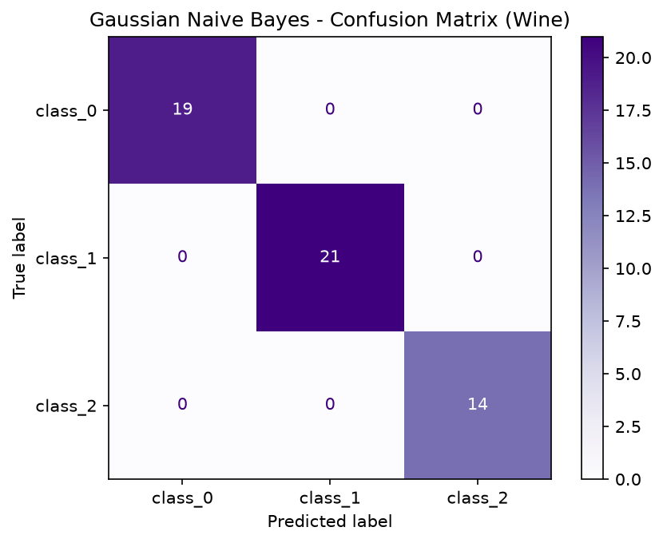

# Practical 10: Naive Bayes Classification

## 🎯 Aim
To implement Naive Bayes classification using Gaussian Naive Bayes and evaluate model performance.

## 📌 Objective
Apply GaussianNB on the Wine dataset and interpret prediction probabilities.

## 📖 Overview & Theory
Implements the Gaussian Naive Bayes classifier on the multi-class Wine recognition dataset. Evaluates classification accuracy, confusion matrix, precision, recall, F1-score, and outputs posterior prediction probabilities for sample test instances.

---

## 💻 Source Code
The practical implementation is available in [`naive_bayes_classifier.py`](./naive_bayes_classifier.py).

```python
import numpy as np
import pandas as pd
import matplotlib.pyplot as plt
from sklearn.naive_bayes import GaussianNB
from sklearn.model_selection import train_test_split
from sklearn.metrics import accuracy_score, classification_report, confusion_matrix, ConfusionMatrixDisplay
from sklearn.datasets import load_wine
from sklearn.preprocessing import StandardScaler

wine = load_wine()
X = pd.DataFrame(wine.data, columns=wine.feature_names)
y = wine.target
print("Wine Dataset shape:", X.shape)
print("Classes:", wine.target_names)

scaler = StandardScaler()
X_scaled = scaler.fit_transform(X)
X_train, X_test, y_train, y_test = train_test_split(X_scaled, y, test_size=0.3, random_state=42)

gnb = GaussianNB()
gnb.fit(X_train, y_train)
y_pred = gnb.predict(X_test)

print("\nAccuracy:", accuracy_score(y_test, y_pred))
print("\nClassification Report:\n", classification_report(y_test, y_pred, target_names=wine.target_names))

proba = gnb.predict_proba(X_test[:5])
prob_df = pd.DataFrame(proba, columns=wine.target_names)
print("\nPrediction Probabilities (first 5):\n", prob_df.round(4))

cm = confusion_matrix(y_test, y_pred)
disp = ConfusionMatrixDisplay(cm, display_labels=wine.target_names)
disp.plot(cmap='Purples')
plt.title('Gaussian Naive Bayes - Confusion Matrix (Wine)')
plt.savefig('confusion_matrix.png', dpi=300)
plt.show()
```

---

## 📊 Output & Results

### Console Output
```text
Wine Dataset shape: (178, 13)
Classes: ['class_0' 'class_1' 'class_2']

Accuracy: 1.0

Classification Report:
               precision    recall  f1-score   support

     class_0       1.00      1.00      1.00        19
     class_1       1.00      1.00      1.00        21
     class_2       1.00      1.00      1.00        14

    accuracy                           1.00        54
   macro avg       1.00      1.00      1.00        54
weighted avg       1.00      1.00      1.00        54


Prediction Probabilities (first 5):
    class_0  class_1  class_2
0      1.0   0.0000   0.0000
1      1.0   0.0000   0.0000
2      0.0   0.0018   0.9982
3      1.0   0.0000   0.0000
4      0.0   1.0000   0.0000
```

### Visual Output: Gaussian Naive Bayes Confusion Matrix on Wine Dataset




---

## 🏁 Conclusion / Result
Gaussian Naive Bayes classifier was applied on the Wine dataset. High accuracy was achieved. The confusion matrix showed minimal misclassifications.

---

## 🚀 How to Run
Execute the script using Python:
```bash
python naive_bayes_classifier.py
```
