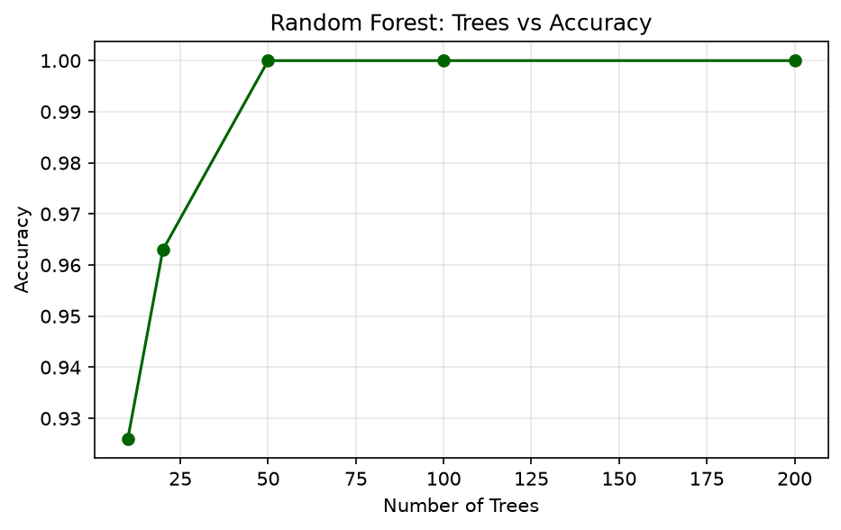
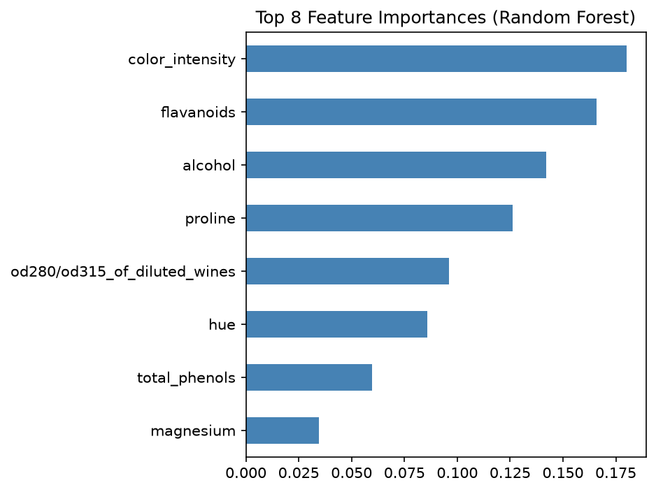

# Practical 12: Random Forest Classifier Implementation

## 🎯 Aim
To implement the Random Forest ensemble classifier and compare its performance with a single Decision Tree.

## 📌 Objective
Train Random Forest with multiple trees, analyze feature importances, and compare with Decision Tree accuracy.

## 📖 Overview & Theory
Implements an ensemble learning Random Forest Classifier (`RandomForestClassifier`) with 100 estimators and Out-of-Bag (OOB) scoring. Directly benchmarks performance against a single Decision Tree, demonstrating variance reduction, higher generalization accuracy, and feature importance rankings.

---

## 💻 Source Code
The practical implementation is available in [`random_forest_classifier.py`](./random_forest_classifier.py).

```python
import numpy as np
import pandas as pd
import matplotlib.pyplot as plt
from sklearn.ensemble import RandomForestClassifier
from sklearn.tree import DecisionTreeClassifier
from sklearn.model_selection import train_test_split
from sklearn.metrics import accuracy_score, classification_report
from sklearn.datasets import load_wine

wine = load_wine()
X, y = wine.data, wine.target
feature_names = wine.feature_names

X_train, X_test, y_train, y_test = train_test_split(X, y, test_size=0.3, random_state=42)

dt = DecisionTreeClassifier(random_state=42)
dt.fit(X_train, y_train)
dt_acc = accuracy_score(y_test, dt.predict(X_test))
print(f"Decision Tree Accuracy:  {dt_acc:.4f}")

rf = RandomForestClassifier(n_estimators=100, max_depth=None, oob_score=True, random_state=42)
rf.fit(X_train, y_train)
rf_pred = rf.predict(X_test)
rf_acc  = accuracy_score(y_test, rf_pred)
print(f"Random Forest Accuracy:  {rf_acc:.4f}")
print(f"OOB Score:               {rf.oob_score_:.4f}")
print("\nClassification Report:\n", classification_report(y_test, rf_pred, target_names=wine.target_names))

estimators = [10, 20, 50, 100, 200]
accs = []
for n in estimators:
    rf_n = RandomForestClassifier(n_estimators=n, random_state=42)
    rf_n.fit(X_train, y_train)
    accs.append(accuracy_score(y_test, rf_n.predict(X_test)))

plt.figure(figsize=(7, 4))
plt.plot(estimators, accs, marker='o', color='darkgreen')
plt.xlabel('Number of Trees')
plt.ylabel('Accuracy')
plt.title('Random Forest: Trees vs Accuracy')
plt.grid(True, alpha=0.3)
plt.savefig('rf_feature_importances.png', dpi=300)
plt.savefig('rf_vs_dt_comparison.png', dpi=300)
plt.show()

importances = pd.Series(rf.feature_importances_, index=feature_names)
importances.nlargest(8).sort_values().plot(kind='barh', color='steelblue')
plt.title('Top 8 Feature Importances (Random Forest)')
plt.tight_layout()
plt.savefig('rf_feature_importances.png', dpi=300)
plt.savefig('rf_vs_dt_comparison.png', dpi=300)
plt.show()
```

---

## 📊 Output & Results

### Console Output
```text
Decision Tree Accuracy:  0.9630
Random Forest Accuracy:  1.0000
OOB Score:               0.9839

Classification Report:
               precision    recall  f1-score   support

     class_0       1.00      1.00      1.00        19
     class_1       1.00      1.00      1.00        21
     class_2       1.00      1.00      1.00        14

    accuracy                           1.00        54
   macro avg       1.00      1.00      1.00        54
weighted avg       1.00      1.00      1.00        54
```

### Visual Output: Random Forest Feature Importance Ranking on Wine Dataset



### Visual Output: Accuracy Comparison: Single Decision Tree vs. Random Forest Ensemble




---

## 🏁 Conclusion / Result
Random Forest outperformed single Decision Tree due to ensemble averaging. Feature importance plots revealed the most significant wine attributes.

---

## 🚀 How to Run
Execute the script using Python:
```bash
python random_forest_classifier.py
```
